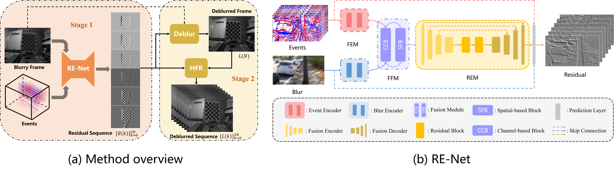
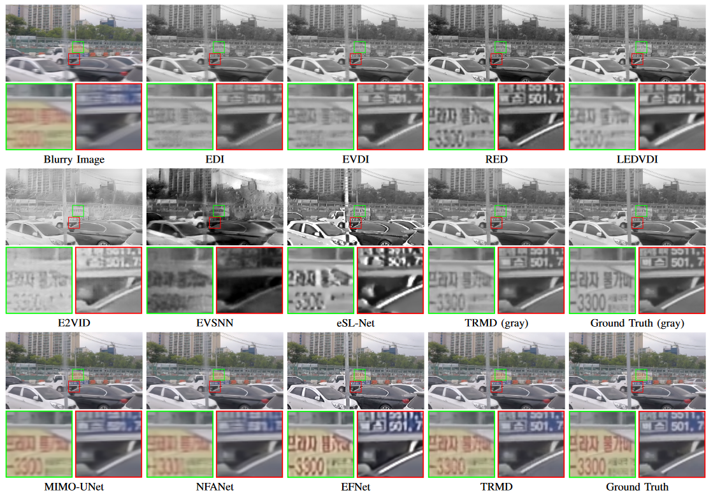
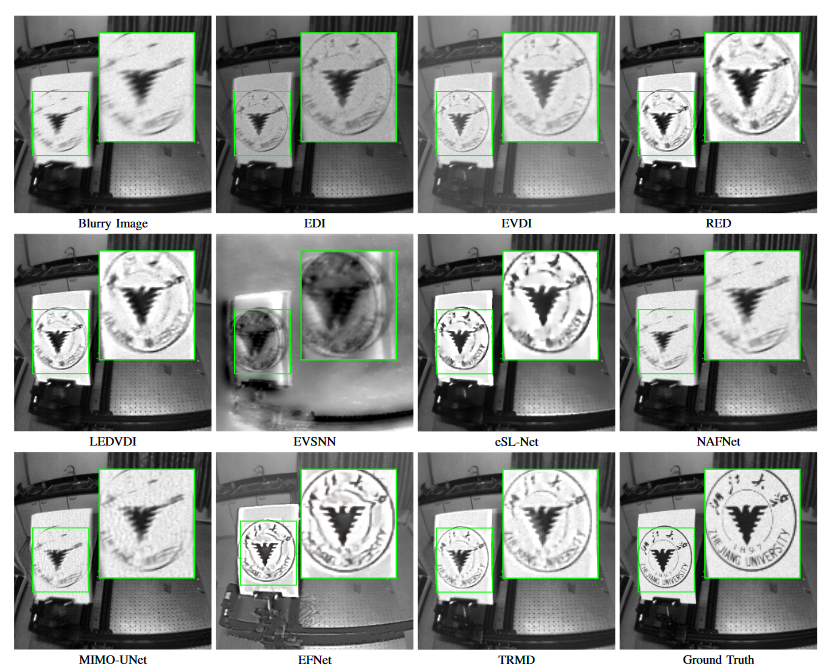

<h2 align="center"> 
  <a href="https://doi.org/10.1109/TMM.2024.3355630">Motion Deblur by Learning Residual from Events (TMM 2024)</a>
</h2>
<h5 align="center"> 
If you like our project, please give us a star ⭐ on GitHub.  </h5>
<h5 align="center">

**Authors:** Kang Chen and [Lei Yu](http://eis.whu.edu.cn/index/szdwDetail?rsh=00030713&newskind_id=20160320222026165YIdDsQIbgNtoE)✉️ from Wuhan university, Wuhan, China.

[](https://doi.org/10.1109/TMM.2024.3355630)
[](https://github.com/chenkang455/TRMD)
[](https://github.com/chenkang455/TRMD/stargazers)&#160;


</h5>

<p align="center">  
  
</p>

## 📕 Abstract
>  We propose a Two-stage Residual-based Motion Deblurring (TRMD) framework for an event camera, which converts a blurry image into a sequence of sharp images, leveraging the abundant motion features encoded in events.
In the first stage, a residual estimation network is trained to estimate the residual sequence, which measures the intensity difference between the intermediate frame and other frames sampled during the exposure. 
In the subsequent stage, the previously estimated residuals are combined with the blurry image to reconstruct the deblurred sequence based on the physical model of motion blur.

## 👀 Visual Comparisons
<details open><summary><strong>GoPro dataset </strong></summary>
<p align="center">

</p>
</details>

<details open><summary><strong>REBlur dataset </strong> </summary>
<p align="center">

</p>
</details>


## 🌏 Setup environment
```
git clone https://github.com/chenkang455/TRMD
cd TRMD
pip install -r requirements.txt
```
## 🕶 Download datasets
You can download our trained models, synthesized dataset GOPRO and real event dataset REBlur (from [EFNet](https://github.com/AHupuJR/EFNet)) from [Baidu Netdisk](https://pan.baidu.com/s/1advngktF3hiHzLO_fs6E0w?pwd=e1uc) with the password ```eluc```. 

Unzip the ```GOPRO.zip``` file before placing the downloaded models and datasets (path defined in [config.yaml](https://github.com/chenkang455/TRMD/blob/main/config.yaml)) according to the following directory structure:
```                                                                                            
├── Data                                                                                                                                                            
│   ├── GOPRO                                                                                              
│   │   └── train                                                                                                                             
│   │   └── test                                                                                    
|   ├── REBlur
|   |   └── train
|   |   └── test   
|   |   └── addition
|   |   └── README.md 
├── Pretrained_Model
│   ├── RE_Net.pth 
│   ├── RE_Net_rgb.pth 
├── config.yaml
├── ...
```


## 🍭 Configs
Change the data path and other parameters (if needed) in [config.yaml](https://github.com/chenkang455/TRMD/blob/main/config.yaml). 

### 🌅 Test with our pre-trained models
* To test the metric and visualize the deblurred result on **GRAY-GOPRO**:
```
python test_GoPro.py --rgb False --load_unet True --load_path Pretrained_Model/RE_Net_GRAY.pth
```
* To test the metric and visualize the deblurred result on **RGB-GOPRO**:
```
python test_GoPro.py --rgb True --load_unet True --load_path Pretrained_Model/RE_Net_RGB.pth
```
* To visualize the deblurred result on **REBlur**:
```
python test_REBlur.py --load_unet True --load_path Pretrained_Model/RE_Net_GRAY.pth
```
* To test our model size and FLOPs:
```
python network.py 
```


## 📊 Training
* To train our model from scratch on **GRAY-GOPRO**:
```
python train_GoPro.py --rgb False --save_path Model/RE_Net_GRAY.pth
```
* To train our model from scratch on **RGB-GOPRO**:
```
python train_GoPro.py --rgb True --save_path Model/RE_Net_RGB.pth
```


## 📞 Contact
Should you have any questions, please feel free to contact [mrchenkang@whu.edu.cn](mailto:mrchenkang@whu.edu.cn) or [ly.wd@whu.edu.cn](mailto:ly.wd@whu.edu.cn).

## 🤝 Citation
If you find our work useful in your research, please cite:

```
@article{chen2024motion,
  title={Motion Deblur by Learning Residual from Events},
  author={Chen, Kang and Yu, Lei},
  journal={IEEE Transactions on Multimedia},
  year={2024},
  publisher={IEEE} 
}
```

## 🙇‍ Acknowledgment

Our event representation (SCER) code and REBlur dataset are derived from [EFNet](https://github.com/AHupuJR/EFNet). Some of the code for metric testing and module construction is from [E-CIR](https://github.com/chensong1995/E-CIR). We appreciate the effort of the contributors to these repositories.
